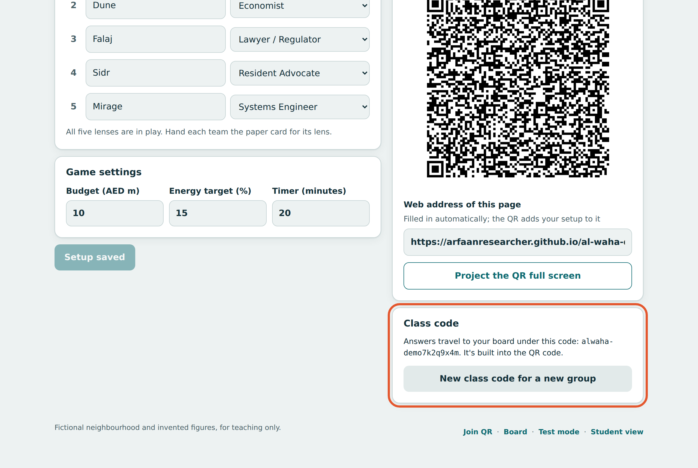
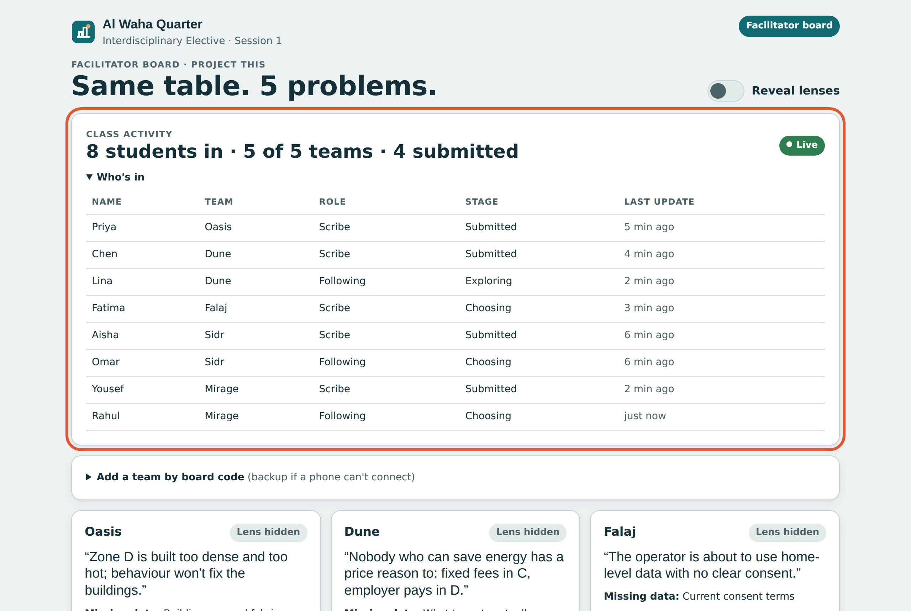
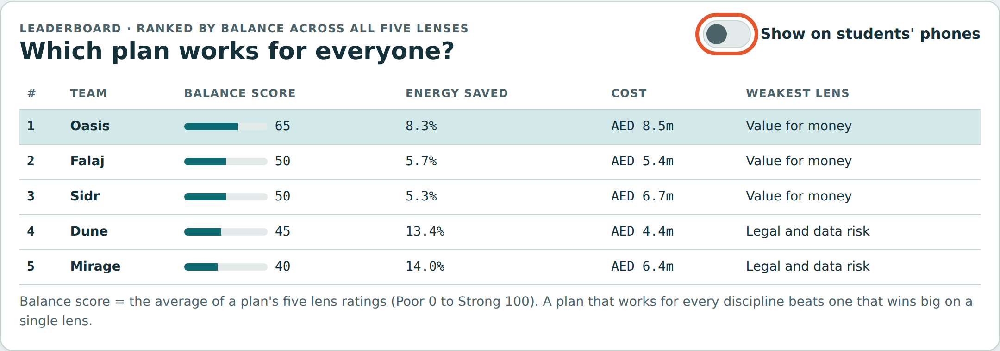
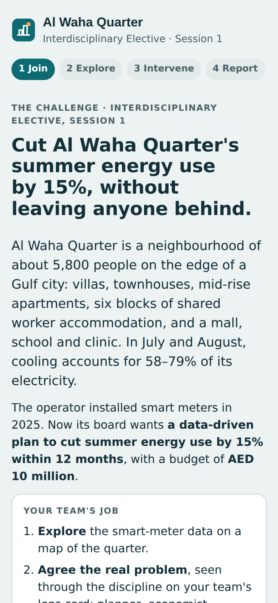
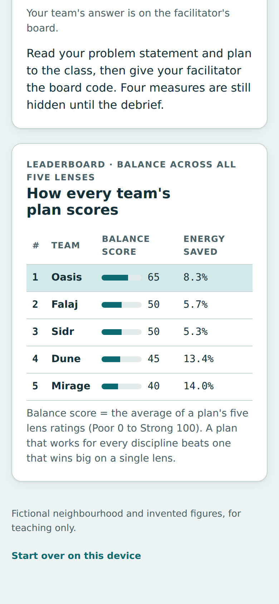

# Al Waha Quarter

An interactive case activity for the **Interdisciplinary Elective** (M.Sc. Data Science). Teams explore the smart-meter data of a fictional Dubai-style neighbourhood through one discipline's lens, agree what the real problem is, and spend a budget on interventions. The facilitator watches every team live, then reveals that each team had a different lens, and ranks the plans by how well they work for **all five** disciplines.

**Live page:** https://arfaanresearcher.github.io/al-waha-quarter/

The neighbourhood and every figure in it are invented for teaching.

- [Facilitator guide](#facilitator-guide)
- [Student guide](#student-guide)
- [How live updates work](#how-live-updates-work)

---

## Facilitator guide

### Before class (about 5 minutes)

**1. Open the setup screen.** Go to the live page and click **Facilitator** at the bottom, or add `#setup` to the address. Set how many teams you want (2–8), rename them and give each a lens. Hand each team the paper lens card that matches its lens.

**2. Check the game settings and save.** Budget (AED million), energy target (%), timer length. Click **Save setup**. The setup is stored on this computer and built into the class QR code.

**3. Check the class code.** Answers travel to your board under a class code that is built into the QR code. Use **New class code for a new group** before each new class, so last session's answers don't appear.

**4. Start the timer, then project the QR code.** **Start timer** shows a countdown on your screen and on every phone that scans the QR afterwards. Then click **Project the QR full screen**.

### During the activity: see everyone's progress

**5. Open the board.** Click **Board** at the bottom (or add `#board`). The **Class activity** panel shows how many students have joined, which teams are in, and who has submitted. **Who's in** lists every student, their team, role and stage (Exploring, Choosing, Submitted). The green **Live** pill means updates are arriving. Each team's card fills in with its scribe's problem statement and plan as they work.

If a phone can't connect, the scribe reads out the **board code** on their report card and you type it under **Add a team by board code**.

### Debrief

**6. Reveal the lenses.** Switch on **Reveal lenses**. Each card shows its team's lens, and the debrief table scores every plan on all five lenses. The outlined cell is the team's own lens: each plan does well there and poorly somewhere else. Students' report screens show the same table.

**7. Show the leaderboard.** The leaderboard is always visible to you on the board. It ranks plans by **balance score**: the average of the five lens ratings (Poor 0 to Strong 100). A plan that works for every discipline beats one that wins big on one lens. The **Weakest lens** column is a good discussion prompt. Switch on **Show on students' phones** when you want them to see it.

**Discussion prompts:** Why did no team top every lens? Which team's weakest lens surprised you? What would you trade to raise it?

### Rehearse on your own

**Test mode** (`#test`) shows a student phone beside your board. Play each team and check the whole flow. Nothing in test mode reaches students. On the board, **Load example answers** lets you rehearse the reveal and leaderboard on their own.

---

## Student guide

**1. Scan the QR code** on the screen with your phone camera. No app or account needed.

**2. Read the challenge.** The front page explains the neighbourhood, the operator's request and your team's job.

**3. Join your team.** Type your first name, pick your team, and choose your role. One person per team is the **scribe**: they submit the team's answer. Everyone else picks **I'm following along**.

**4. Explore the map.** Tap a zone to see its data. The buttons above the map recolour it by different measures; the dot marks where your lens starts.

**5. Agree the real problem.** Use the prompts in your lens box. The scribe writes the team's problem statement.

**6. Spend the budget.** Tap interventions to fund them. You see budget used, progress towards the target, and your lens's score only.

**7. Submit and report back.** The scribe taps **Submit our plan** and reads the report card to the class.

**8. At the debrief** your screen shows how your plan scores on all five lenses, and the leaderboard when your facilitator switches it on.

**Tips:** answers stay on your phone if you refresh; followers can explore and suggest picks, but only the scribe submits.

---

## How live updates work

The page is a single static file with no server of its own. Phones send small updates (first name, team, role, stage, problem statement and chosen interventions) to the free public relay [ntfy.sh](https://ntfy.sh) under a random class code, and the facilitator's board listens for them. Anyone who knows the class code could read those messages, and the relay deletes them after about 12 hours, so students should enter only a first name. If the relay is unavailable, board codes still work.

## Screens at a glance

| Screen | Address | Who |
| --- | --- | --- |
| Student join | the QR link | Students |
| Setup | `#setup` | Facilitator |
| Projected QR | `#qr` | Facilitator |
| Board, activity and leaderboard | `#board` | Facilitator |
| Test mode | `#test` | Facilitator |
