# Al Waha Quarter

An interactive case activity for the **Interdisciplinary Elective** (M.Sc. Data Science, 1st and 2nd semester). Teams explore the smart-meter data of a fictional Dubai-style neighbourhood through one discipline's lens, write down what they think the real problem is, and spend a budget on interventions. At the debrief, the facilitator reveals that every team had a different lens, and shows how each plan wins on its own lens and loses on the others.

**Live page:** https://arfaanresearcher.github.io/al-waha-quarter/

The neighbourhood and every figure in it are invented for teaching.

---

## How to use it: step by step

### Before class (facilitator, about 5 minutes)

**1. Open the setup screen.** Go to the live page and click **Facilitator** at the bottom, or add `#setup` to the address. Set how many teams you want (2–8), rename them and give each team a lens. The line under the list tells you if a lens is not in play. Hand each team the paper lens card that matches its lens.

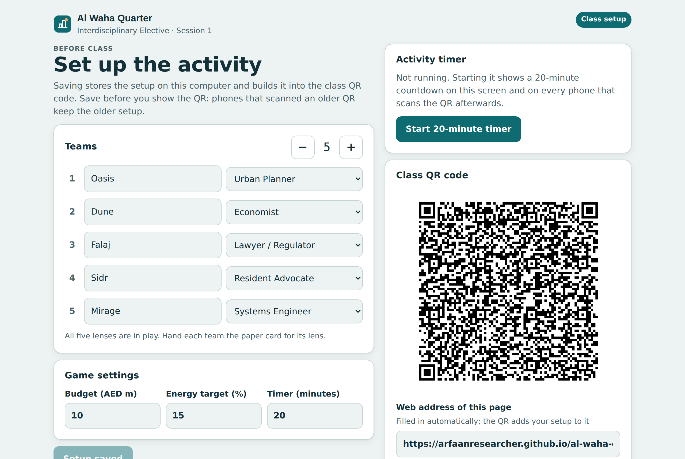

**2. Check the game settings, then save.** Budget (AED million), the operator's energy-saving target (%), and the timer length. Click **Save setup**. Saving stores the setup on this computer and builds it into the class QR code.

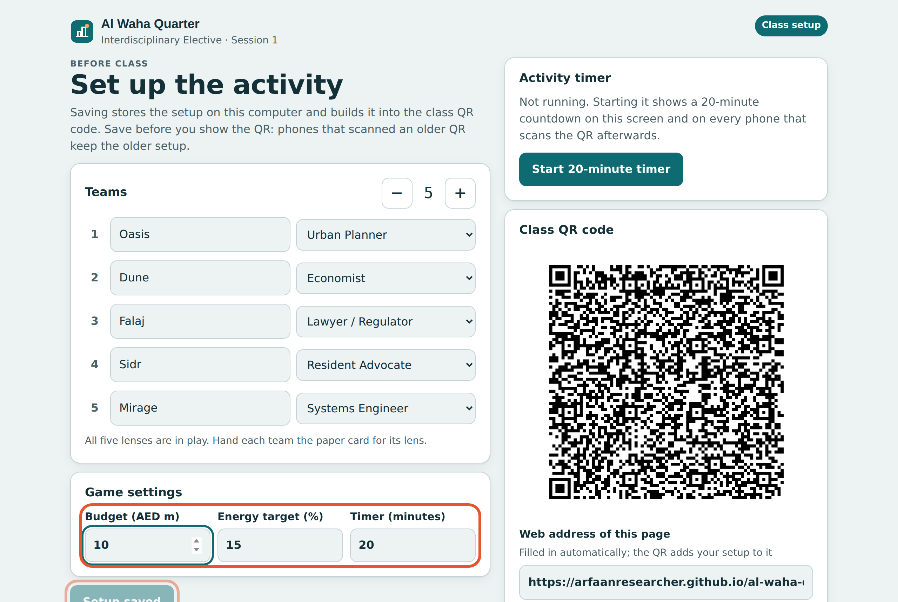

**3. Start the timer when you are ready.** **Start 20-minute timer** shows a countdown at the top of the screen. The QR code updates so that phones scanning it from now on show the same countdown. Start the timer *before* students scan, so everyone gets it.

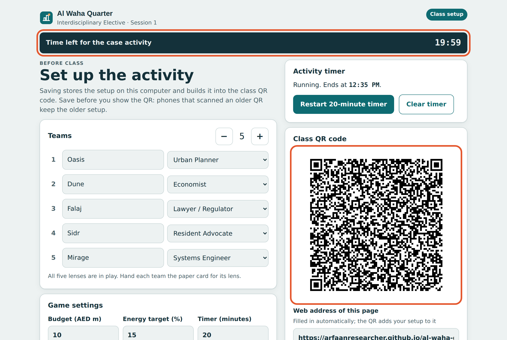

**4. Project the QR code.** Click **Project the QR full screen**. Students scan it with their phone camera; no app or account is needed.

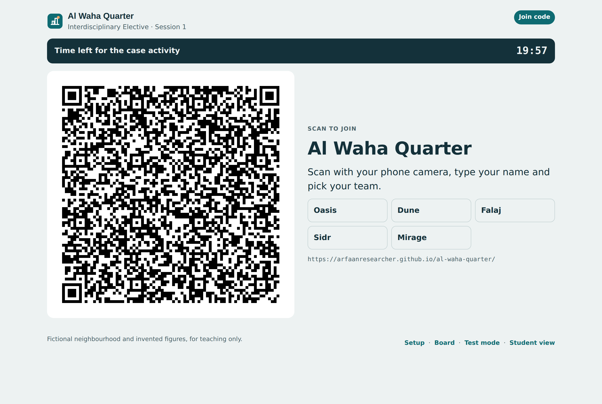

### In class (students)

**5. Join.** Each student types their name, picks their team and chooses a role. One person per team is the **scribe**: they submit the team's answer and can list their teammates' names. Everyone else chooses **I'm following along**.

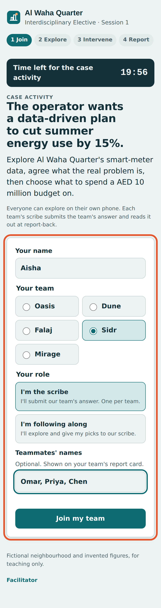

**6. Explore the map.** Tap a zone to see its data. The buttons above the map recolour it by different measures. The dot marks the measure each team's lens starts on, so different teams literally see different pictures.

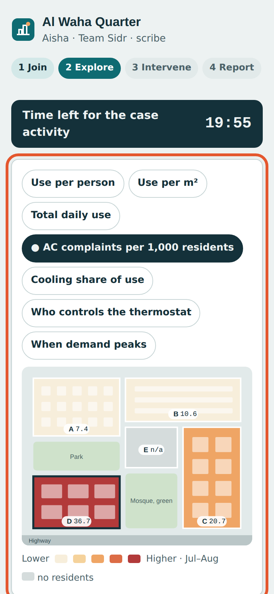

**7. Write the problem statement.** The lens box gives three prompts for the team's discipline. The scribe writes "Through our lens, the real problem is…" and, optionally, the data the team wishes it had.

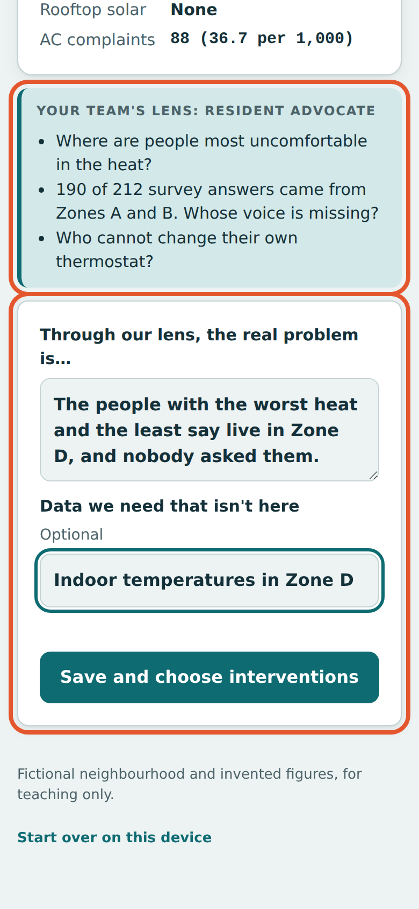

**8. Choose interventions.** Teams fund options within the budget. They see the budget used, progress towards the operator's energy target, and a score for **their own lens only**. The other four measures stay hidden until the debrief.

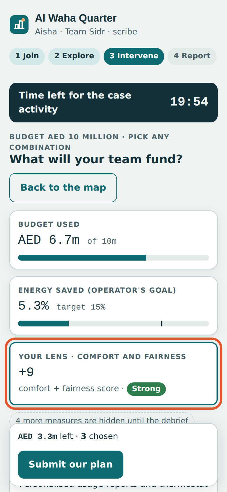

**9. Report back.** After **Submit our plan**, the scribe's phone shows a report card to read out, with a short **board code** (for example `4-7G`).

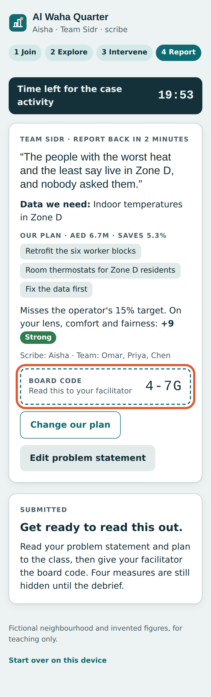

**10. Followers** can explore and try options too, but only the scribe can submit. Their bar says "Only your scribe submits. Tell them your picks."

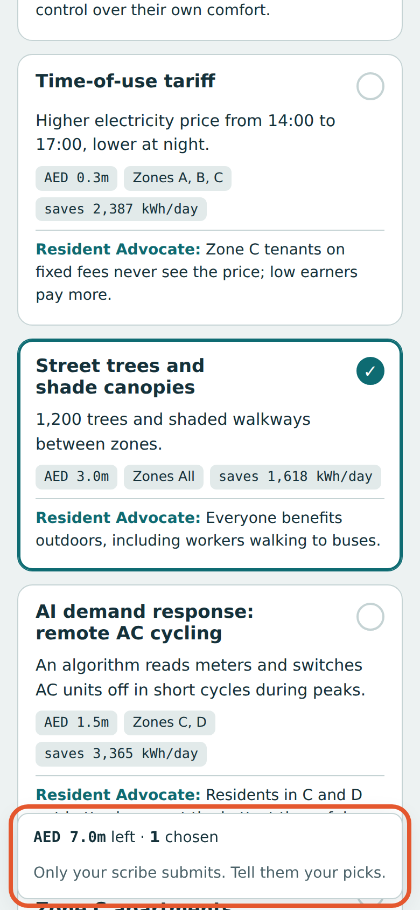

### Debrief (facilitator)

**11. Type each team's board code into the board.** Open **Board** (or add `#board` to the address). As each scribe reads out their code, type it in with a few words of their problem statement and click **Add**. Phones on a public website can't send answers to your screen by themselves, so the code carries the team and its plan.

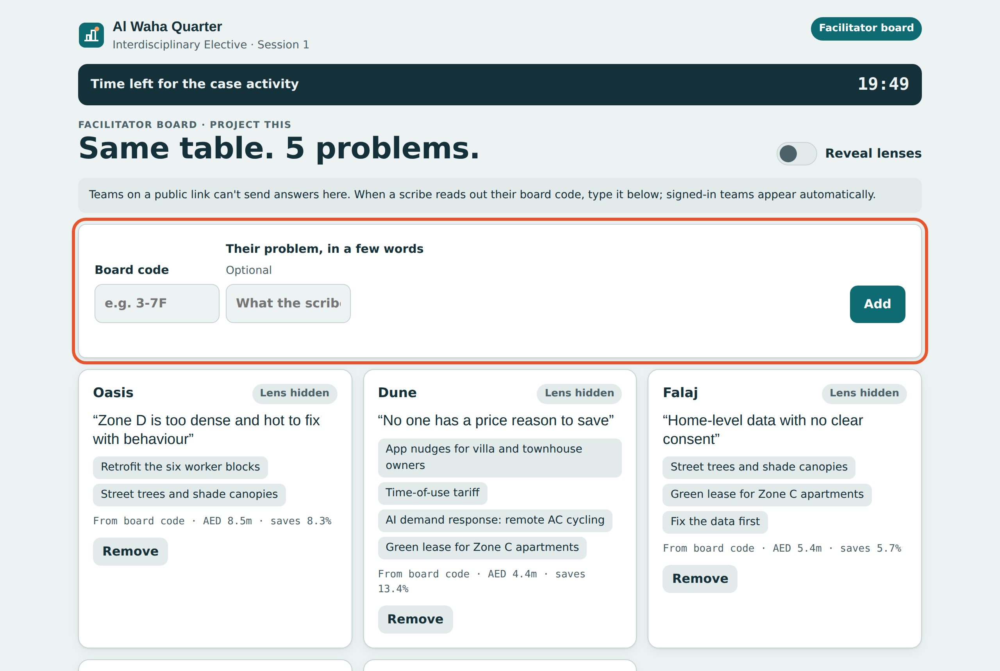

**12. Reveal the lenses.** Switch on **Reveal lenses**. Each card shows its team's lens, and the debrief table scores every plan on all five lenses. The outlined cell is the team's own lens: each plan does well there and poorly somewhere else. Use it to open the discussion: *same data, different questions.*

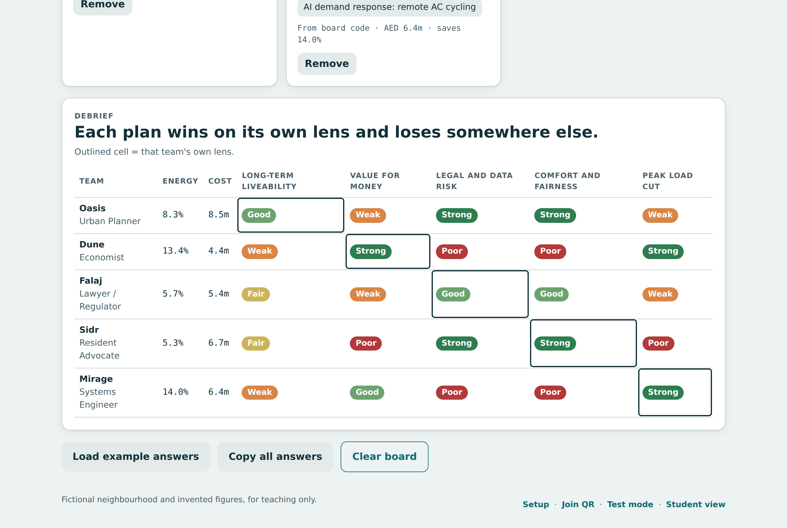

### Rehearse on your own

**13. Test mode.** Add `#test` to the address (or click **Test mode**). A student phone sits on the left and your board on the right. Use **Play as the scribe of** to switch between teams and check the whole flow before class. Nothing in test mode reaches students.

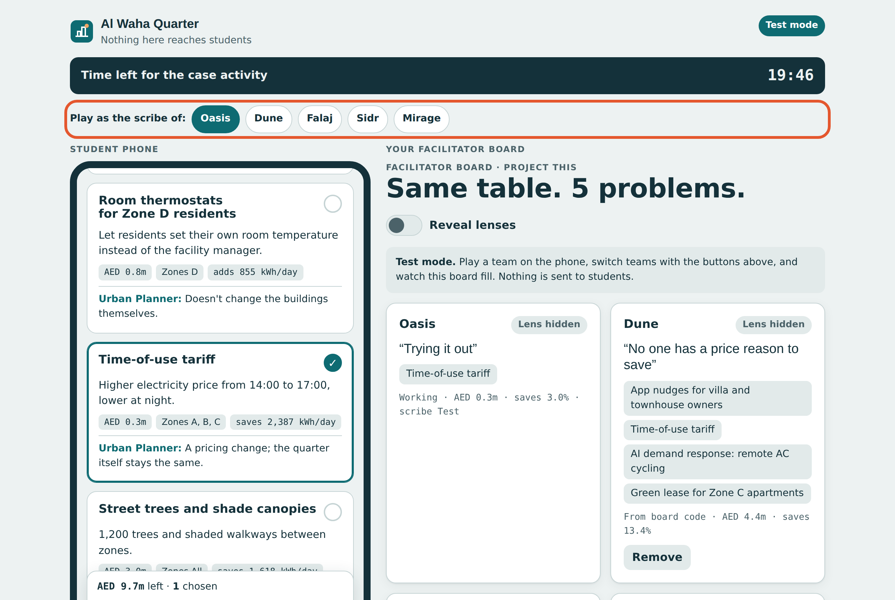

---

## Good to know

- **Settings travel in the QR code.** If you change the setup after students have scanned, show the new QR code again; phones that scanned the old one keep the old setup.
- **Answers stay on each phone.** A student who refreshes or closes the page keeps their answers on that phone. **Start over on this device** at the bottom clears them.
- **Board codes** are the team number, a dash, and the plan (for example `3-BK`). A code the board doesn't recognise shows an error rather than a wrong team.
- **Example answers** on the board let you rehearse the reveal without any students.
- The page is one self-contained file (`index.html`) with no server and no sign-in. The QR code is drawn with [qrcode-generator](https://github.com/kazuhikoarase/qrcode-generator).

## Screens at a glance

| Screen | Address | Who |
| --- | --- | --- |
| Student join | `/` (from the QR code) | Students |
| Setup | `#setup` | Facilitator |
| Projected QR | `#qr` | Facilitator |
| Board | `#board` | Facilitator |
| Test mode | `#test` | Facilitator |
